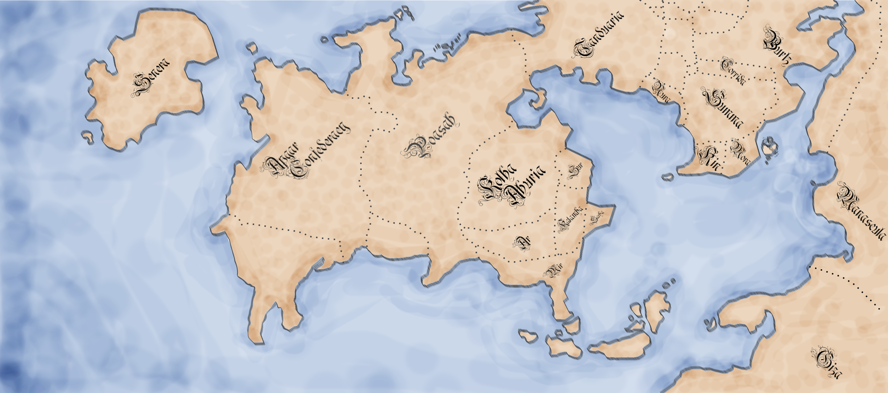

# Betera

A continent that contains the following present-day countries:

 * Ar
 * [The Apgar Confederacy](countries/apgar.md)
 * [Poasah](countries/poasah.md) 
 * Burtz
 * [Calamutz](countries/calamutz.md)
 * Corrida
 * Kin
 * Mehicania 
 * Mir
 * Mora
 * Nura
 * [Poasah](countries/poasah.md)
 * Ralamba
 * Sarha
 * Summa
 * Sur
